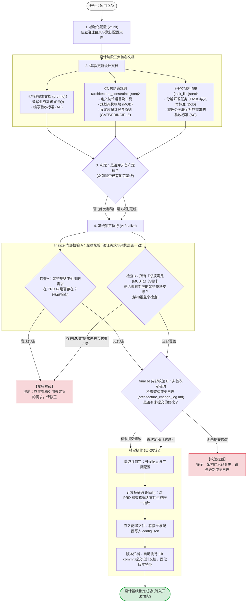

# Vibe Tracing 设计阶段逻辑图及业务流程说明

在 Vibe Tracing 治理框架中，以 `finalize`（定稿锁基线）作为分界线：
*   **之前为【设计阶段】**：主要任务是规划需求、映射架构、编排任务，并建立客观设计基线。
*   **之后为【开发阶段】**：主要任务是编写代码与测试，核对实现与自证声明，完成质量门禁校验。

本文档详细描述了**【设计阶段】**的完整业务逻辑。

---

## 一、 设计阶段核心逻辑图

---

## 二、 设计阶段步骤逻辑详解

### 1. 项目初始化 (`vt init`)
*   **业务目的**：在项目根目录下建立 Vibe Tracing 治理沙箱和模板文档。
*   **逻辑行为**：创建 `.vibetracing/config.json` 基础配置文件，生成包含标准编号（ID）规范的文档模板（prd.md、architecture_constraints.json、task_list.json），并安装 Git pre-commit hook 以便在每次提交时自动执行门禁校验。

### 2. 设计文档协作编写
非开发团队（产品经理、架构师、项目经理）共同输出三个互相绑定的设计文档：
*   **产品需求 (PRD)**：用 `REQ-VT-xxx` 标识独立功能域，用 `AC-VT-xxx-yy` 标识可验证的验收标准。
*   **架构约束**：用 `MOD-VT-xxx` 划分软件模块，用 `GATE-VT-xxx` 设定质量红线，指定开发语言（如 `python`）及配套检查工具。
*   **任务清单**：用 `TASK-VT-xxx` 编排任务，用 `DOD-VT-xxx-yy` 规定完成定义，并且每个任务必须显式声明它满足 PRD 中的哪一个 `AC-VT-xxx-yy`（完成需求映射）。

### 3. 架构变更可追溯校验（`vt finalize` 内部执行）
当项目不是第一次定稿，而是对设计进行修改时，系统需要防止”无记录修改”：
*   **逻辑规则**：如果架构约束文件内容发生了结构化改变（通过 `ArchitectureChangeProposalEngine._find_differences()` 检测），系统会调用 `git_has_uncommitted_changes()` 检查《架构变更日志 (`architecture_change_log.md`)》是否有未提交的 Git 修改。如果日志文件未被修改，**程序将中断锁定流程**。
*   **注意**：此校验仅检查文件是否有未提交的变更，不校验变更日志的具体内容。首次定稿时跳过此检查。

### 4. 映射一致性校验（左移门禁，`vt finalize` 内部执行）
系统全自动检查 PRD 与架构约束之间的一致性，防止“空想设计”或“遗漏需求”：
*   **检查A（防死链）**：架构约束中规划的每个功能模块所支撑的需求，必须在 PRD 中真实存在。若存在不存在的需求 ID，则拦截。
*   **检查B（防遗漏）**：所有在 PRD 中被归类为“MUST（必须实现）”的核心需求，必须在架构约束中规划对应的逻辑模块去支撑它。若有 MUST 需求未映射到架构模块，说明设计有遗漏，则拦截。

### 5. 规则人工确认 (`vt accept`)
*   **业务目的**：架构约束中的部分规则（如软性设计原则、质量红线等）需要人类确认批准后才能视为生效。
*   **逻辑行为**：项目经理或架构师手动运行 `vt accept <rule_id>` 命令，系统在 `architecture_constraints.json` 的所有规则段（architecture_principles、module_boundaries、quality_gates 等 15 类）中查找匹配的 rule_id，找到后在其上标记 `accepted_by` 和 `accepted_at` 字段。
*   **注意**：`vt accept` 是独立的 CLI 命令，与 `vt finalize` 无强制执行顺序，可在 finalize 前后或独立运行。

### 6. 基线锁定 (`vt finalize`)
`vt finalize` 是设计阶段的终点命令，在一次调用中依次执行全部校验和锁定操作：
1.  **映射一致性校验**：调用 `validate_prd_architecture_mapping_from_path()` 执行左移门禁（死链检查 + MUST 覆盖率检查）。校验失败则中止。
2.  **架构变更日志校验**（仅非首次定稿）：检查 `architecture_change_log.md` 是否有未提交的修改。未更新则中止。
3.  **锁定配置**：将架构文档中指定的开发语言和校验工具正式写入 `.vibetracing/config.json`，锁死本次的质量规则。
4.  **生成防篡改指纹**：计算当前 `prd.md` 和 `architecture_constraints.json` 的 SHA-256 唯一指纹哈希值。
5.  **提交归档**：自动运行 `git add` 和 `git commit` 将设计文档（prd.md、architecture_constraints.json、config.json）提交到 Git 本地历史仓库中，并将最终的 Git 提交 Hash 值存入配置文件。
6.  **分界确立**：自此，设计阶段成果被正式封存。后续只要开发人员私自改动了这些设计文件，开发阶段的 `analyze` 分析流水线就会立刻识别出”指纹不符（基线被篡改）”并发出阻断预警。

> **注意**：`task_list.json` 不包含在 finalize 的 git commit 中（任务清单属于开发阶段产物，由开发阶段自行管理）。此外，`vt init` 还会安装 Git pre-commit hook，在每次提交时自动执行门禁校验。
