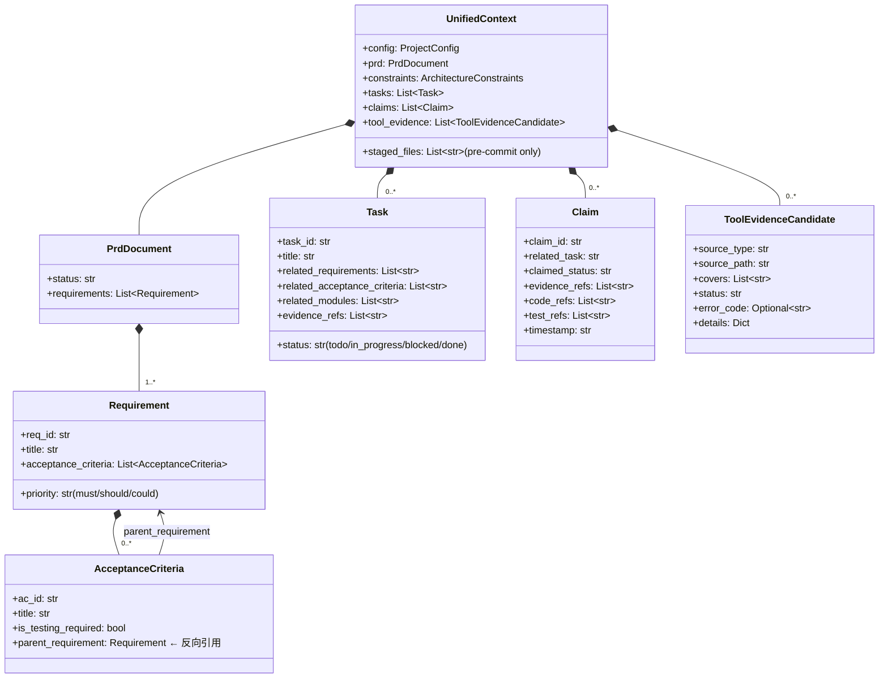
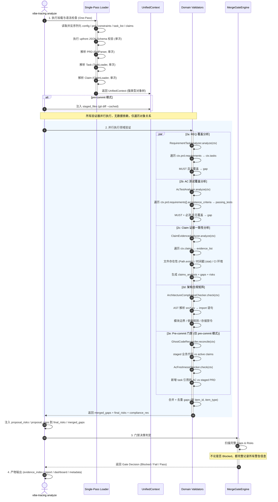

# Vibe Tracing 核心架构重构提案：强类型领域模型

本设计方案遵循**第一性原则 (First Principles)**，对 Vibe Tracing 开发阶段 (`vt analyze`) 的流程和逻辑顺序进行深层次的重构设计。

现有的逻辑采用的是**基于扁平列表的、多阶段顺序扫描式**的管道流。这种设计在规模变大时会产生大量的重复文件 I/O、无意义的重复解析、以及逻辑上的割裂。

---

## 一、 第一性原则的拆解 (Deconstruction)

### 1. 什么是"可追溯性 (Traceability)"？
在软件治理中，可追溯性的本质是一个**有向图 (Directed Graph)**。
* **顶点 (Vertices / Nodes)**：设计实体（REQ、AC）、过程实体（Task、Claim）、实现实体（Code File）以及凭证实体（Test Case, Tool Report）。
* **边 (Edges / Relationships)**：实体之间的关联关系（`covers`、`references`、`verifies`、`implements`）。

### 2. 什么是"质量门禁 (Quality Gate)"？
在图模型下，治理规则可以表达为**拓扑查询 + 运行时谓词**的组合：
* **声明式覆盖关系**（可纯图化）：REQ → Task → Claim → Code → Test 的覆盖链路。
* **运行时谓词**（不可图化）：文件存在性、修改时间戳、Git staged 状态、工具执行结果。

### 3. 设计决策：强类型领域模型 vs 通用图引擎

> [!IMPORTANT]
> **决策**：不采用通用图数据库或邻接表重写 Analyzer。采用**强类型领域对象树**，各 Analyzer 直接基于 Python 属性引用进行遍历。

**理由**：
1. **VT 规模不需要图引擎**：R < 100, E < 1000。O(R×E) 的集合运算在内存中已经是纳秒级。
2. **强类型优于弱类型图**：`req.acceptance_criteria[0].ac_id` 比 `graph.neighbors(req_id, edge_type="contains")[0]` 更安全、更可读、IDE 支持更好。
3. **Python 属性引用本身就是有向图**：`Task.requirements → [REQ]`、`Claim.related_task → Task` 在内存中构成对象引用图，Python GC 使用的正是有向图遍历（引用计数 + 循环检测）。
4. **运行时谓词无法图化**：`Path.exists()`、`stat().st_mtime`、`os.getenv("CI")` 是文件系统和环境操作，强行塞入图模型会导致边携带复杂谓词标签，丧失抽象意义。

**结论**：将 UnifiedContext 设计为强类型领域对象树，各 Analyzer 直接遍历对象关系——这在实质上以最 Pythonic 的方式实现了有向图的拓扑查询，同时保留了类型安全和 IDE 可推导性。

---

## 二、 核心架构重构设计：强类型领域模型

### 1. 领域对象模型 (Domain Object Model)



### 2. 两段式流水线 (Two-Stage Pipeline)

与原提案的三段式不同，强类型领域模型不需要独立的"图编译"阶段——领域对象之间的 Python 引用关系本身就是图。流水线简化为：

1. **统一上下文加载 (Single-Pass Loader)**：文件只读一次，Schema 校验只执行一次，输出 `UnifiedContext`。
2. **领域验证器群 (Domain Validators)**：各 Analyzer 接收 `UnifiedContext`，直接遍历对象关系。

```
┌─────────────────────────────────────────────────────────┐
│                    Single-Pass Loader                    │
│  config.json ─┐                                         │
│  prd.md ──────┤                                         │
│  constraints ─┤── 读取 + Schema 校验 ──→ UnifiedContext │
│  task_list ───┤                                         │
│  claims.json ─┘                                         │
└────────────────────────┬────────────────────────────────┘
                         │
                         ▼
┌─────────────────────────────────────────────────────────┐
│                  Domain Validators                       │
│                                                          │
│  ┌──────────────────┐  ┌──────────────────┐             │
│  │ ReqTaskAnalyzer   │  │ AcTestAnalyzer    │             │
│  │ ctx.tasks ×       │  │ ctx.tasks ×       │             │
│  │ ctx.prd.reqs      │  │ passing_tests     │             │
│  └──────────────────┘  └──────────────────┘             │
│  ┌──────────────────┐  ┌──────────────────┐             │
│  │ ClaimEvidence     │  │ ArchCompliance    │             │
│  │ Analyzer          │  │ Checker           │             │
│  │ ctx.claims ×      │  │ ctx.constraints × │             │
│  │ evidence_list     │  │ src/*.py (AST)    │             │
│  └──────────────────┘  └──────────────────┘             │
│  ┌──────────────────┐  ┌──────────────────┐             │
│  │ RiskAdvisor       │  │ MergeGateEngine   │             │
│  │ gaps + claims +   │  │ gaps + risks +    │             │
│  │ compliance        │  │ compliance        │             │
│  └──────────────────┘  └──────────────────┘             │
└─────────────────────────────────────────────────────────┘
```

---

## 三、 重构后的逻辑顺序与流程



---

## 四、 核心改造路线图

> [!IMPORTANT]
> **重构优先级**：以解决实际痛点（重复 I/O、信息丢失）为第一优先级。推迟通用图引擎。

### Step 1：UnifiedContext + 单次加载

* **目标**：消灭 2 倍 I/O 和重复解析。
* **改动**：
  * 创建 `vibe_tracing/context.py`，定义 `UnifiedContext` 强类型领域对象树。
  * `cli.py` 成为唯一的 I/O 执行者：头部加载一次，完成 Schema 校验和 PRD/Task/Claim 解析，组装 `UnifiedContext`。
  * `EvidenceIndexBuilder.build()` 接受 `context: UnifiedContext` 参数，不再内部重新加载。
  * `RequirementTaskAnalyzer`、`AcTestAnalyzer`、`ClaimEvidenceAnalyzer`、`ArchitectureComplianceChecker` 的 `analyze()` / `check()` 方法改为接受 `context: UnifiedContext`。
  * 移除 `EvidenceIndexBuilder` 内部的 `RawInputLoader`、`PrdParser`、`TaskLoader`、`ClaimLoader` 实例化。

* **消除的冗余**：

  | 操作 | 重构前 | 重构后 |
  |---|---|---|
  | `RawInputLoader.load()` | 2 次 | 1 次 |
  | `PrdParser.parse_file()` | 2 次 | 1 次 |
  | `TaskLoader.load_and_validate()` | 2 次 | 1 次 |
  | `ClaimLoader.load_and_validate()` | 2 次 | 1 次 |
  | `SchemaValidator` 校验 task_list | 2 次 | 1 次 |
  | `SchemaValidator` 校验 claims | 2 次 | 1 次 |
  | `SchemaValidator` 校验 constraints | 2 次 | 1 次 |

### Step 2：MergeGateEngine 逻辑修复

* **目标**：解决"Blocked 时吞掉 Warn 警告"的逻辑缺陷。
* **改动**：
  * 修改 `merge_gate_engine.py`，移除 `if gate_decision != "blocked":` 限制。
  * 遍历所有 gaps 和 risks。即使 `gate_decision = "blocked"`，依然将 `should` / `warning` 级别的问题记录到 `reasons` 数组中。
  * Gate Decision 优先级保持：`blocked > fail > pass`，但 reasons 包含完整缺陷清单。

### Step 3（可选，按需）：领域对象关系优化

* **触发条件**：VT 实体规模增长到 R > 500，或需要跨项目追溯。
* **改动方向**：
  * 在 `UnifiedContext` 中建立反向索引（如 `Requirement → [Task]`、`AC → [TestEvidence]`），将 O(R×E) 的列表扫描优化为 O(1) 的字典查找。
  * 这不是图引擎，而是对领域对象树的索引优化——本质上是给 Python 对象引用加上哈希表加速。

---

## 五、 关键设计细节

### 1. UnifiedContext 的生命周期

```
cli.py (唯一 I/O 入口)
  │
  ├─ load_and_build_context() → UnifiedContext
  │   ├─ RawInputLoader.load()
  │   ├─ SchemaValidator.validate() (一次性)
  │   ├─ PrdParser.parse_file()
  │   ├─ TaskLoader.load_and_validate()
  │   ├─ ClaimLoader.load_and_validate()
  │   └─ return UnifiedContext(...)
  │
  ├─ ctx = load_and_build_context()
  │
  ├─ pre-commit 门禁 (使用 ctx.staged_files)
  ├─ 工具执行 (使用 ctx.config + ctx.constraints)
  ├─ 证据索引构建 (使用 ctx)
  ├─ 分析器群 (使用 ctx)
  ├─ 门禁决策 (使用 gaps + risks)
  └─ 产物输出
```

### 2. 运行时谓词的分离

`ClaimEvidenceAnalyzer` 中的文件系统操作保持为**外置 Validator**，依附于内存模型运行：

```python
class ClaimEvidenceAnalyzer:
    def analyze(self, ctx: UnifiedContext) -> Dict:
        for claim in ctx.claims:
            # 声明式关系查询（内存中完成）
            task = ctx.find_task(claim.related_task)  # O(1) 或 O(T)

            # 运行时谓词（文件系统操作，作为独立检查）
            for ref in claim.code_refs:
                if not Path(ref).exists():           # ← 运行时谓词
                    risks.append(...)
                elif file_mtime > claim_ts:           # ← 运行时谓词
                    risks.append(...)
```

声明式关系和运行时谓词在同一方法中共存，但语义上分离：前者是对象图遍历，后者是文件系统检查。不需要额外的抽象层。

### 3. Pre-commit 门禁的处理

`GhostCodeReconciler` 和 `AcFreshnessChecker` 依赖 `git diff --cached`（瞬时状态）。设计上：
- `UnifiedContext` 不持有 Git 状态（它是持久化的领域模型）。
- Pre-commit 门禁在 `cli.py` 中作为**前置检查**执行，使用 `ctx` 中的 claims 数据与 Git staged 文件比对。
- 这保持了领域模型的纯净性——Git 状态是运行时输入，不是领域数据。

---

## 六、 独立审核报告（历史记录）

> 以下审核基于对当前 `vt analyze` 全部源码的逐行审计。审核结论已纳入上述设计决策。

### 1. 提案正确的部分

**核心洞察成立**：可追溯性本质上是有向图。REQ → Task → Claim → Code → Test 的关系天然构成图结构，质量门禁本质上是图的拓扑查询。这个抽象是准确的。

**问题诊断准确**：与源码审计交叉验证，提案指出的三个核心问题全部命中：
- 重复 I/O（`EvidenceIndexBuilder` 全量重加载全部输入文件）
- 重复 Schema 校验（Step 1.1 与 Step 4a/4b 双重执行）
- `MergeGateEngine` 的 `if gate_decision != "blocked"` 静默吞掉警告

**三段式管道架构合理**：Loader → Compiler → Validator 的关注点分离是干净的。

### 2. 提案存在的问题（已修正）

#### [CRITICAL] 问题 1：将图模型过度泛化——大部分校验不是图查询

提案声称"所有的治理规则和门禁都可以退化为图的拓扑查询"，但实际代码中三个核心分析器的逻辑**无法退化为图遍历**：

- `RequirementTaskAnalyzer`：需要 `priority == "must"` 条件判断和集合运算。
- `AcTestAnalyzer`：需要 `priority == "must"` AND `is_testing_required == True` 布尔谓词。
- `ClaimEvidenceAnalyzer`：执行文件系统检查（`exists`、`mtime`）、环境变量判断（`CI`）、集合冲突检测。

**修正**：采用强类型领域模型 + 外置运行时谓词，不强行将所有逻辑图化。

#### [HIGH] 问题 2：复杂度声称有误

提案声称"将复杂度由 O(N²) 降低至 O(V+E)"，但当前分析器实际是 O(R×E)，在 VT 规模下已接近线性。真正的瓶颈是重复 I/O，不是算法复杂度。

**修正**：Step 1 解决 I/O 问题，Step 3（可选）通过反向索引优化查找，不引入图引擎。

#### [HIGH] 问题 3：图边语义混杂

`Task covers REQ`、`Test covers AC`、`Claim declares Code`、`Report proves Test` 四种边语义完全不同，同一图中用同类型边表示会丧失抽象意义。

**修正**：强类型领域模型中，每种关系是独立的 Python 属性（`task.related_requirements`、`claim.code_refs`），类型系统天然区分语义。

#### [MEDIUM] 问题 4：工具执行被忽略

`ToolExecutionEngine` 是动态子进程执行，不是静态图编译。

**修正**：工具执行保留在 `cli.py` 中作为独立步骤，执行结果注入 `UnifiedContext.tool_evidence`。

#### [MEDIUM] 问题 5：Git 状态未纳入图模型

`git diff --cached` 是瞬时状态，不适合纳入持久化领域模型。

**修正**：Git 状态作为 `cli.py` 的运行时输入，不纳入 `UnifiedContext`。

#### [LOW] 问题 6："需求变更防漂移校验"不存在

当前代码中没有此功能，是新特性而非重构。

**修正**：从重构范围中移除，作为独立 feature 跟踪。

### 3. 路线图评估

| 步骤 | 评估 | 风险 |
|---|---|---|
| Step 1: UnifiedContext | **合理且低风险**。直接解决重复 I/O 问题，可以独立交付。 | 低 |
| Step 2: MergeGateEngine 修复 | **合理且低风险**。移除 `if != "blocked"` 限制，纯逻辑修复。 | 低 |
| ~~Step 3: UTG 图编译器~~ | **已推迟**。改用强类型领域对象树 + 可选索引优化。 | N/A |
