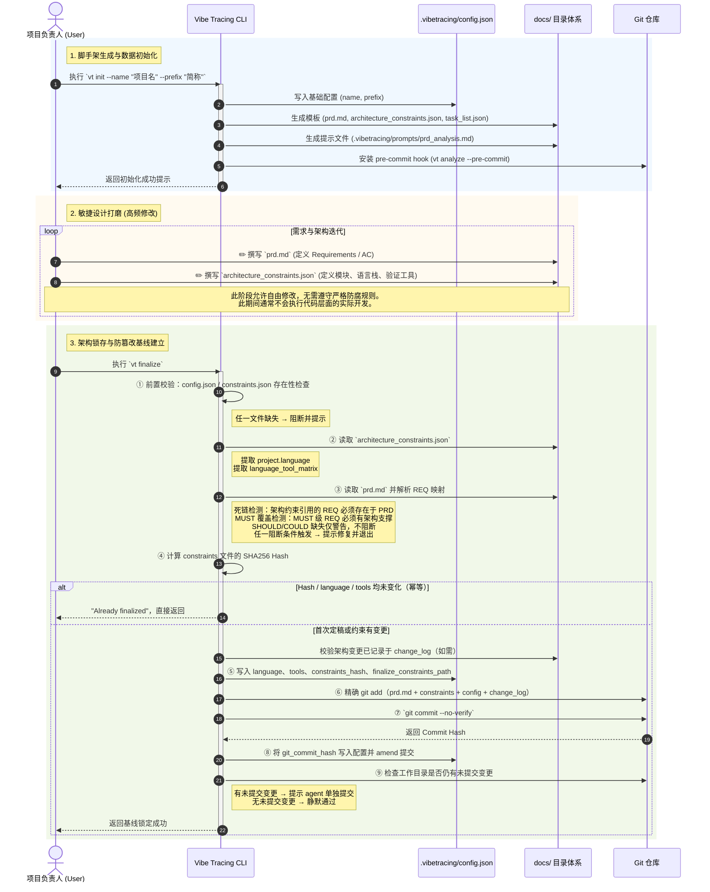
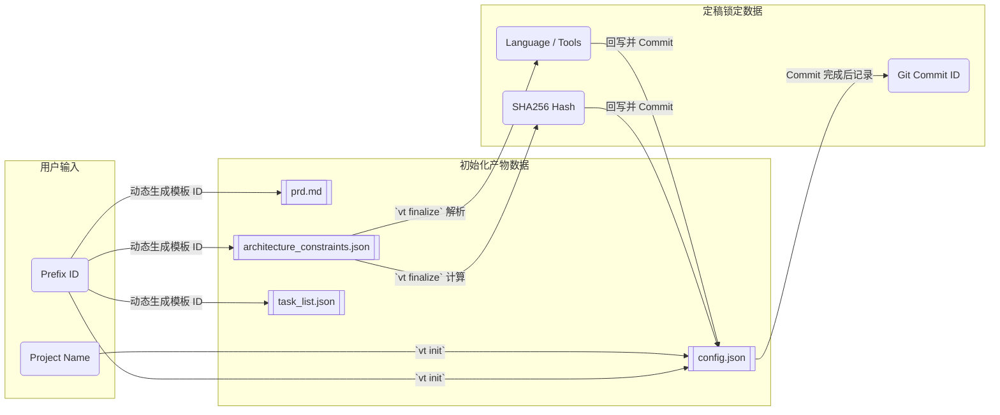

# 设计阶段：用户视角逻辑与数据流

本视图从用户的实际操作角度出发，详细拆解了 Vibe Tracing **设计阶段 (Design Phase)** 的完整生命周期：从使用 `vt init` 创建脚手架，到手动编辑核心设计文档，最终通过 `vt finalize` 锁定基线。

### 数据流转图 (Data Flow)

> [!TIP]
> **设计哲学**：设计阶段的本质是将”人类模糊的意图”逐步转化为”机器可严格校验的数据契约”。`vt init` 提供了承载契约的容器，而 `vt finalize` 则为这些契约盖上了”公章”，从而开启第二阶段严格的代码级审查。

### 已完成项：精确锁定基线，限制 `vt finalize` 的提交范围

> [!NOTE]
> **实现状态**：`vt finalize` 已采用精确文件列表提交策略，仅添加以下契约文件：
> 1. `docs/prd.md`
> 2. `docs/architecture_constraints.json`
> 3. `docs/architecture_change_log.md`（仅当文件存在时）
> 4. `.vibetracing/config.json`
>
> 同时包含安全过滤器，移除磁盘上不存在的文件。`docs/task_list.json` 等开发流转文件不会被纳入基线提交。

### 已完成项：设计期一致性左移校验 (Shift-Left Validation)

> [!NOTE]
> **实现状态**：`_validate_prd_architecture_mapping()` 已在 `vt finalize` 流程中实现，作为哈希计算之前的前置校验门：
> 1. **死链强阻断**：架构约束中引用的 `REQ-XXX` 不存在于 PRD → 阻断并退出。
> 2. **核心覆盖强阻断**：`MUST` 级 REQ 无架构支撑 → 阻断并退出。
> 3. **非核心覆盖警告**：`SHOULD/COULD` 级 REQ 缺失架构映射 → 仅 WARNING，不阻断。
>
> 对 PRD 缺失、解析失败、无需求定义等边界情况均做了优雅降级（警告跳过）。

### 已完成项：移除 Frozen PRD Auditor 死代码

> [!NOTE]
> **实现状态**：`FrozenPrdAuditor` 模块、测试文件及所有引用已全部清理。`frozen_prd_auditor.py`、`test_prd_frozen_audit.py` 及 cli.py 中的 import 和调用均已删除，无残留引用。
>
> **关于 PRD 防篡改哈希的设计决策**：PRD 哈希防篡改方案不纳入 VT 治理范围。VT 的核心目标是**引导 AI coding agent 在约束内工作**，而非防范恶意攻击。PRD 是人类编写的业务契约，其变更属于正常的需求演进流程，Git 历史天然提供完整审计链。`architecture_constraints.json` 的哈希校验已足够保护 AI agent 面对的指令层完整性。

### 开发阶段治理缺口分析：Agent 跳过 PRD 直接写代码

> [!NOTE]
> **设计哲学**：VT 的目标不是限制 AI coding agent，而是在其未按规范操作时**提醒它回到正确流程**。正确的流程是：更新 PRD → 更新架构约束（如需）→ 明确 task → 写代码。REQ 代表宏观业务场景与架构边界，变更频率低；AC 代表实现细节与测试场景，在开发过程中高频演进。治理检测应聚焦在 AC 粒度。

**推演场景**：人类要求"增加 CSV 导出功能"。

| 路径 | Agent 行为 | PRD 变更 | task_list 变更 | 当前拦截？ |
|---|---|---|---|---|
| A | 按规范操作 | 新增 `AC-VT-001-03` | 新增 task，引用 REQ-VT-001 + AC-VT-001-03 | N/A（合规） |
| B | 引用不存在的 AC | 无 | 新增 task，引用 REQ-VT-001 + AC-VT-001-03 | **已拦截**（Task Loader line 315：AC 不存在于 PRD） |
| C | 用已有 AC 蒙混 | 无 | 新增 task，引用 REQ-VT-001 + 已有的 AC-VT-001-01 | **WARNING**（Gate 2.5 AC 新鲜度检测：PRD 未同步更新） |
| D | task 不挂 AC | 无 | 新增 task，仅引用 REQ-VT-001 | **已拦截**（strict_link=true 时 AND 逻辑：line 284-295） |

**路径 C 的问题**：task 引用了已有的 AC-VT-001-01（仪表盘 HTML），但实际代码实现的是 CSV 导出。所有结构性校验通过，PRD 从未描述 CSV 导出功能，VT 无法感知语义错配。

**路径 D 的问题**：~~`task_loader.py` 的 isolated check 使用 `OR` 逻辑~~ → **已修复**。当 `id_rules.all_tasks_must_link_requirements_and_acceptance_criteria` 为 `true` 时，`task_loader.py`（line 284-295）已采用 `AND` 逻辑——task 必须同时关联 REQ 和 AC。

**架构约束不需要变化**：AC 变更不涉及模块边界、依赖规则、数据流等架构级约束，`architecture_constraints.json` 在此场景中是静默的。

### 已完成项：强制执行 task 必须关联 AC（路径 D 补洞）

> [!NOTE]
> **实现状态**：`task_loader.py`（line 284-295）已实现 `AND` 逻辑。当 `id_rules.all_tasks_must_link_requirements_and_acceptance_criteria` 为 `true` 时，task 必须同时关联 REQ 和 AC，缺失任一则标记为 invalid 并输出修复引导。

### 已完成项：Pre-commit AC 新鲜度检测（路径 C 补洞）

> [!NOTE]
> **实现状态**：`AcFreshnessChecker`（`src/vibe_tracing/ac_freshness_checker.py`）已实现，作为 `vt analyze --pre-commit` 的 Gate 2.5（`cli.py:568-574`，紧随 Gate 2 Ghost Code Reconciliation 之后）。检测逻辑：
> 1. `git diff --cached --name-only` 检测 `docs/prd.md` 是否在 staged 变更中。
> 2. `git show :docs/prd.md` 提取 staged 版本中的 AC ID 集合（正则 `AC-[A-Z]+-\d+-\d+`）。
> 3. 对比 staged vs HEAD 的 `task_list.json`，识别本次新增的 task。
> 4. 新增 task 引用的 AC 不在本次 PRD 变更范围内 → 输出 WARNING（不阻断）。
>
> 测试覆盖 7 个场景（`tests/test_ac_freshness.py`），包括 PRD 未更新、AC 不匹配、多 task 多 AC 等边界情况。

### 已完成项：初始化模板补充 `language_tool_matrix` 节点

> [!NOTE]
> **实现状态**：`architecture_constraints.template.json` 已包含 `language_tool_matrix` 节点（line 25-58），预填充 `python` 工具矩阵（pytest、coverage、ruff、mypy、bandit）。`test_scaffolding.py` 已验证 init 生成物包含该节点及完整结构。

---

## 原子化任务清单

### Phase 1：模板与脚手架修补 ✅

| Task ID | 任务 | 涉及文件 | 状态 |
|---|---|---|---|
| REFACTOR-001 | 在 `architecture_constraints.template.json` 中补充 `language_tool_matrix` 节点，预填充 python 工具矩阵骨架 | `templates/architecture_constraints.template.json` | ✅ 已完成 |
| REFACTOR-002 | 更新脚手架测试，验证 init 生成的 constraints 包含 `language_tool_matrix` | `tests/test_scaffolding.py` | ✅ 已完成 |

### Phase 2：死代码清理 ✅

| Task ID | 任务 | 涉及文件 | 状态 |
|---|---|---|---|
| REFACTOR-003 | 删除 `FrozenPrdAuditor` 模块 | `src/vibe_tracing/traceability/frozen_prd_auditor.py` | ✅ 已完成 |
| REFACTOR-004 | 删除 `FrozenPrdAuditor` 测试 | `tests/test_prd_frozen_audit.py` | ✅ 已完成 |
| REFACTOR-005 | 移除 cli.py 中 FrozenPrdAuditor 的 import 和调用 | `src/vibe_tracing/cli.py` | ✅ 已完成 |
| REFACTOR-006 | 验证全量测试通过（确认无隐式依赖） | 全项目 | ✅ 已完成 |

### Phase 3：Task Loader 核心校验强化 ✅

| Task ID | 任务 | 涉及文件 | 状态 |
|---|---|---|---|
| REFACTOR-007 | 在 `task_loader.py` 中读取 `id_rules.all_tasks_must_link_requirements_and_acceptance_criteria` 配置 | `src/vibe_tracing/task_loader.py:159-161` | ✅ 已完成 |
| REFACTOR-008 | 当配置为 `true` 时，将 isolated check 从 `OR` 改为 `AND`：task 必须同时关联 REQ 和 AC | `src/vibe_tracing/task_loader.py:284-295` | ✅ 已完成 |
| REFACTOR-009 | 新增单元测试：task 仅有 REQ 无 AC 时，配置为 true 应标记 invalid | `tests/test_task_loader.py:355` | ✅ 已完成 |
| REFACTOR-010 | 新增单元测试：task 仅有 REQ 无 AC 时，配置为 false 应保持现有行为 | `tests/test_task_loader.py:391` | ✅ 已完成 |

### Phase 4：`vt finalize` 精确提交与左移校验 ✅

| Task ID | 任务 | 涉及文件 | 状态 |
|---|---|---|---|
| REFACTOR-011 | 将 `git add` 替换为逐文件精确添加：`prd.md`、`constraints`、`config`、`change_log` | `src/vibe_tracing/cli.py:384-395, 441-452` | ✅ 已完成 |
| REFACTOR-012 | 实现 `architecture_change_log.md` 存在性检测逻辑 | `src/vibe_tracing/cli.py:444-446` | ✅ 已完成 |
| REFACTOR-013 | 更新 finalize 测试，验证 git add 的文件列表精确匹配 | `tests/test_finalize.py:486` | ✅ 已完成 |
| REFACTOR-014 | 在 `run_finalize()` 中新增 PRD 解析逻辑 | `src/vibe_tracing/cli.py:252-253` | ✅ 已完成 |
| REFACTOR-015 | 实现死链检测：架构约束引用的 REQ 不存在于 PRD → 阻断 | `src/vibe_tracing/cli.py:267-273` | ✅ 已完成 |
| REFACTOR-016 | 实现核心覆盖检测：MUST 级 REQ 无架构支撑 → 阻断 | `src/vibe_tracing/cli.py:284-291` | ✅ 已完成 |
| REFACTOR-017 | 实现非核心覆盖警告：SHOULD/COULD 级缺失 → WARNING | `src/vibe_tracing/cli.py:293-299` | ✅ 已完成 |
| REFACTOR-018 | 新增 finalize 左移校验测试 | `tests/test_finalize.py:557` | ✅ 已完成 |

### Phase 5：Pre-commit AC 新鲜度检测 ✅

| Task ID | 任务 | 涉及文件 | 状态 |
|---|---|---|---|
| REFACTOR-019 | 实现 staged PRD 变更检测 | `src/vibe_tracing/ac_freshness_checker.py:74-86` | ✅ 已完成 |
| REFACTOR-020 | 实现 staged PRD 解析，提取 AC ID 集合 | `src/vibe_tracing/ac_freshness_checker.py:88-102` | ✅ 已完成 |
| REFACTOR-021 | 实现 task delta 检测（staged vs HEAD） | `src/vibe_tracing/ac_freshness_checker.py:104-143` | ✅ 已完成 |
| REFACTOR-022 | 实现 AC 新鲜度比对，不匹配则输出 WARNING | `src/vibe_tracing/ac_freshness_checker.py:22-68` | ✅ 已完成 |
| REFACTOR-023 | 集成到 `vt analyze --pre-commit` 流程（Gate 2.5） | `src/vibe_tracing/cli.py:568-574` | ✅ 已完成 |
| REFACTOR-024 | 新增测试：7 个场景覆盖 | `tests/test_ac_freshness.py` | ✅ 已完成 |
