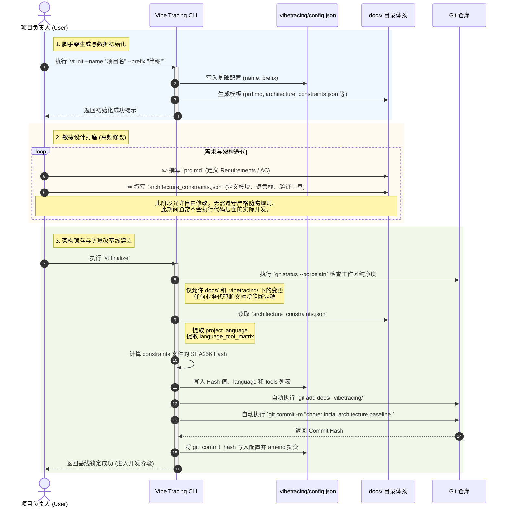
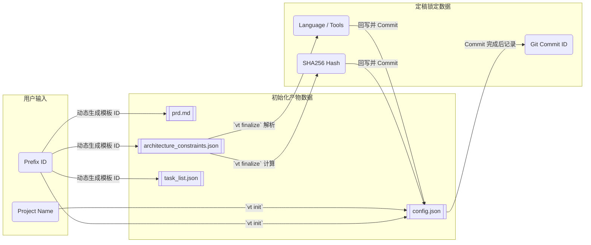

# 设计阶段：用户视角逻辑与数据流

本视图从用户的实际操作角度出发，详细拆解了 Vibe Tracing **设计阶段 (Design Phase)** 的完整生命周期：从使用 `vt init` 创建脚手架，到手动编辑核心设计文档，最终通过 `vt finalize` 锁定基线。

### 数据流转图 (Data Flow)

> [!TIP]
> **设计哲学**：设计阶段的本质是将”人类模糊的意图”逐步转化为”机器可严格校验的数据契约”。`vt init` 提供了承载契约的容器，而 `vt finalize` 则为这些契约盖上了”公章”，从而开启第二阶段严格的代码级审查。

### 待修改项：精确锁定基线，限制 `vt finalize` 的提交范围

> [!WARNING]
> **当前代码实现**：`vt finalize` 在锁定基线时，采用了 `git add docs/ .vibetracing/` 的笼统提交方式（cli.py:290, 335）。

**问题原因 (The Why)**：
使用通配符会导致项目在后续重新执行定稿时，将此时处于半成品状态的 `docs/task_list.json` 等开发流转文件一并提交。这破坏了“将敏捷任务清单作为白名单豁免”的设计初衷，导致基线提交被污染。

**改动决策 (The How)**：
后续需要将自动提交策略重构为“精确制导匹配”。即 `vt finalize` 应当仅且只提交严格的“契约文件”：
1. `docs/prd.md`
2. `docs/architecture_constraints.json`
3. `docs/architecture_change_log.md` (如有)
4. `.vibetracing/config.json`

### 待修改项：设计期一致性左移校验 (Shift-Left Validation)

**问题原因 (The Why)**：
`vt finalize` 作为设计阶段的最后一道关卡，如果在此刻允许一份“存在需求，但没有对应架构支撑”的契约被锁定，这等同于将架构缺陷合法化并带入了开发阶段。在开发阶段中期 (`vt analyze`) 再发现并抛出问题，会导致极高的修复成本，破坏了“早发现早修复”的工程原则。

**改动决策 (The How)**：
将 PRD 与架构约束的映射检查**左移**到 `vt finalize` 执行时：
1. **死链强阻断**：若架构约束中引用了 PRD 中不存在的 `REQ-XXX`，直接阻断并提示修复。
2. **核心覆盖强阻断**：若 PRD 中定义了 `MUST` 级别的需求，但架构约束中没有任何模块支撑它，直接阻断。
3. **非核心覆盖警告**：对于 `SHOULD/COULD` 级别的需求缺失架构映射，仅抛出 WARNING 提示，不阻断定稿，以维持敏捷性。

### 待清理项：移除 Frozen PRD Auditor 死代码

**问题原因 (The Why)**：
当前代码中残留一套基于 `prd.base.md` 基准文件的 PRD 漂移检测机制（`FrozenPrdAuditor`），但该机制从未实际工作过——基准文件不存在于仓库中，且任何 PRD status 为 frozen 的项目会因缺少基准文件被 MergeGateEngine 无条件阻断（must 级 risk → blocked）。

**关于 PRD 防篡改哈希的设计决策**：
经评估，PRD 哈希防篡改方案不纳入 VT 治理范围。VT 的核心目标是**引导 AI coding agent 在约束内工作**，而非防范恶意攻击。PRD 是人类编写的业务契约，其变更属于正常的需求演进流程，Git 历史天然提供完整审计链。对 PRD 施加哈希锁会带来严重的敏捷性副作用——AC 的高频变更（补充测试场景、微调验收标准）会因哈希漂移被迫触发 `vt finalize` 重基线化，产生大量与架构无关的治理开销。`architecture_constraints.json` 的哈希校验已足够保护 AI agent 面对的指令层完整性。

**清理范围**：
1. `src/vibe_tracing/traceability/frozen_prd_auditor.py`（模块本体）
2. `tests/test_prd_frozen_audit.py`（测试文件）
3. `src/vibe_tracing/cli.py:34`（import 语句）
4. `src/vibe_tracing/cli.py:788-790`（实例化与调用）

### 开发阶段治理缺口分析：Agent 跳过 PRD 直接写代码

> [!NOTE]
> **设计哲学**：VT 的目标不是限制 AI coding agent，而是在其未按规范操作时**提醒它回到正确流程**。正确的流程是：更新 PRD → 更新架构约束（如需）→ 明确 task → 写代码。REQ 代表宏观业务场景与架构边界，变更频率低；AC 代表实现细节与测试场景，在开发过程中高频演进。治理检测应聚焦在 AC 粒度。

**推演场景**：人类要求"增加 CSV 导出功能"。

| 路径 | Agent 行为 | PRD 变更 | task_list 变更 | 当前拦截？ |
|---|---|---|---|---|
| A | 按规范操作 | 新增 `AC-VT-001-03` | 新增 task，引用 REQ-VT-001 + AC-VT-001-03 | N/A（合规） |
| B | 引用不存在的 AC | 无 | 新增 task，引用 REQ-VT-001 + AC-VT-001-03 | **已拦截**（Task Loader line 315：AC 不存在于 PRD） |
| C | 用已有 AC 蒙混 | 无 | 新增 task，引用 REQ-VT-001 + 已有的 AC-VT-001-01 | **未拦截** ❌ |
| D | task 不挂 AC | 无 | 新增 task，仅引用 REQ-VT-001 | **未拦截** ❌ |

**路径 C 的问题**：task 引用了已有的 AC-VT-001-01（仪表盘 HTML），但实际代码实现的是 CSV 导出。所有结构性校验通过，PRD 从未描述 CSV 导出功能，VT 无法感知语义错配。

**路径 D 的问题**：`task_list.json` 声明了 `all_tasks_must_link_requirements_and_acceptance_criteria: true`，但 `task_loader.py` 的实际校验（line 280）是 `OR` 逻辑——只要 REQ 和 AC 有一个就通过。配置未执行。

**架构约束不需要变化**：AC 变更不涉及模块边界、依赖规则、数据流等架构级约束，`architecture_constraints.json` 在此场景中是静默的。

### 待修改项：强制执行 task 必须关联 AC（路径 D 补洞）

**问题原因 (The Why)**：
`task_list.json` 的 `id_rules.all_tasks_must_link_requirements_and_acceptance_criteria` 配置为 `true`，但 `task_loader.py` 的 isolated check（line 280）使用 `OR` 逻辑——task 只要挂了 REQ 或 AC 其中一个就通过。这导致 AI agent 可以创建只关联 REQ 不关联 AC 的 task，绕过验收标准的约束。

**改动决策 (The How)**：
在 `task_loader.py` 中，当 `id_rules.all_tasks_must_link_requirements_and_acceptance_criteria` 为 `true` 时，将 isolated check 从 `OR` 逻辑改为 `AND` 逻辑——task 必须同时关联 REQ 和 AC，否则标记为 invalid 并输出修复引导："该任务缺少验收标准关联，请在 PRD 中定义对应的 AC 并在 task 中引用。"

### 待修改项：Pre-commit AC 新鲜度检测（路径 C 补洞）

**问题原因 (The Why)**：
AI agent 在开发阶段可能跳过 PRD 更新，直接创建 task 引用已有的 AC 并编写代码。此时代码实现的功能与 PRD 中 AC 的语义不匹配，但所有结构性校验均通过。VT 需要感知"task 引用的 AC 是否在本次提交中被 PRD 一起更新了"，以此判断 agent 是否遵循了正确流程。

**改动决策 (The How)**：
在 `vt analyze --pre-commit` 流程中新增 AC 新鲜度检测：
1. 通过 `git diff --cached --name-only` 检测 `docs/prd.md` 是否在本次 staged 变更中。
2. 如果 PRD 有变更，用 `PrdParser` 解析 staged 版本，提取本次新增/修改的 AC ID 集合。
3. 对本次提交中新增的 task（通过对比 staged vs HEAD 的 `task_list.json` delta），检查其 `related_acceptance_criteria` 是否在上述 AC 集合中。
4. 如果新增 task 引用的 AC 不在本次 PRD 变更范围内 → 输出警告（不阻断）："任务 {task_id} 引用的 AC {ac_id} 未在本次 PRD 更新中涉及，请确认需求文档是否需要同步更新。"

> [!TIP]
> **不阻断的原因**：已有 AC 覆盖多 task 是合法场景（一个 AC 可以由多个 task 实现）。警告而非阻断，保持 agent 的操作灵活性，同时提供明确的修复引导。

### 待修改项：初始化模板缺失 `language_tool_matrix` 节点

**问题原因 (The Why)**：
`vt finalize` 执行时，强依赖 `architecture_constraints.json` 中的 `language_tool_matrix` 顶层字段来提取验证工具列表（cli.py:250-255）。然而 `vt init` 生成的 `architecture_constraints.template.json` 模板中**不存在此节点**。这意味着用户在设计阶段填写完模板后，首次执行 `vt finalize` 必然失败（报错：`language “xxx” not found in language_tool_matrix`），被迫手动补全该字段，破坏了脚手架的开箱可用性。

**改动决策 (The How)**：
在 `architecture_constraints.template.json` 模板中补充 `language_tool_matrix` 节点。根据模板中已有的 `project.language` 占位值（当前为 `”python”`），预填充对应的工具矩阵骨架结构，包含 `test`、`coverage`、`lint`、`type_check`、`security` 等工具类别的命令模板占位。确保 `vt init` 产出的脚手架可以直接通过 `vt finalize` 校验。

---

## 原子化任务清单

### Phase 1：模板与脚手架修补

| Task ID | 任务 | 涉及文件 | 依赖 |
|---|---|---|---|
| REFACTOR-001 | 在 `architecture_constraints.template.json` 中补充 `language_tool_matrix` 节点，预填充 python 工具矩阵骨架 | `templates/architecture_constraints.template.json` | 无 |
| REFACTOR-002 | 更新脚手架测试，验证 init 生成的 constraints 包含 `language_tool_matrix` | `tests/test_scaffolding.py` | REFACTOR-001 |

### Phase 2：死代码清理

| Task ID | 任务 | 涉及文件 | 依赖 |
|---|---|---|---|
| REFACTOR-003 | 删除 `FrozenPrdAuditor` 模块 | `src/vibe_tracing/traceability/frozen_prd_auditor.py` | 无 |
| REFACTOR-004 | 删除 `FrozenPrdAuditor` 测试 | `tests/test_prd_frozen_audit.py` | 无 |
| REFACTOR-005 | 移除 cli.py 中 FrozenPrdAuditor 的 import（line 34）和调用（line 788-790） | `src/vibe_tracing/cli.py` | REFACTOR-003 |
| REFACTOR-006 | 验证全量测试通过（确认无隐式依赖） | 全项目 | REFACTOR-003, 004, 005 |

### Phase 3：Task Loader 核心校验强化

| Task ID | 任务 | 涉及文件 | 依赖 |
|---|---|---|---|
| REFACTOR-007 | 在 `task_loader.py` 中读取 `id_rules.all_tasks_must_link_requirements_and_acceptance_criteria` 配置 | `src/vibe_tracing/task_loader.py` | 无 |
| REFACTOR-008 | 当配置为 `true` 时，将 isolated check（line 280）从 `OR` 改为 `AND`：task 必须同时关联 REQ 和 AC | `src/vibe_tracing/task_loader.py` | REFACTOR-007 |
| REFACTOR-009 | 新增单元测试：task 仅有 REQ 无 AC 时，配置为 true 应标记 invalid | `tests/test_task_loader.py` | REFACTOR-008 |
| REFACTOR-010 | 新增单元测试：task 仅有 REQ 无 AC 时，配置为 false 应保持现有行为 | `tests/test_task_loader.py` | REFACTOR-008 |

### Phase 4：`vt finalize` 精确提交与左移校验

| Task ID | 任务 | 涉及文件 | 依赖 |
|---|---|---|---|
| REFACTOR-011 | 将 `vt finalize` 的 `git add docs/ .vibetracing/`（line 290, 335）替换为逐文件精确添加：`docs/prd.md`、`docs/architecture_constraints.json`、`docs/architecture_change_log.md`（如存在）、`.vibetracing/config.json` | `src/vibe_tracing/cli.py` | 无 |
| REFACTOR-012 | 实现 `docs/architecture_change_log.md` 存在性检测逻辑（仅当文件存在时加入 git add 列表） | `src/vibe_tracing/cli.py` | REFACTOR-011 |
| REFACTOR-013 | 更新 finalize 测试，验证 git add 的文件列表精确匹配（不包含 task_list.json） | `tests/test_finalize.py` | REFACTOR-011 |
| REFACTOR-014 | 在 `run_finalize()` 中新增 PRD 解析逻辑：调用 `PrdParser` 提取所有 REQ ID | `src/vibe_tracing/cli.py` | 无 |
| REFACTOR-015 | 实现死链检测：扫描 `architecture_constraints.json` 中所有 `related_requirements` 字段，若引用的 REQ 不存在于 PRD → 阻断 | `src/vibe_tracing/cli.py` | REFACTOR-014 |
| REFACTOR-016 | 实现核心覆盖检测：遍历 PRD 中 MUST 级 REQ，检查架构约束中是否有至少一个模块/规则与之关联 → 无则阻断 | `src/vibe_tracing/cli.py` | REFACTOR-014 |
| REFACTOR-017 | 实现非核心覆盖警告：SHOULD/COULD 级 REQ 缺失架构映射时输出 WARNING（不阻断） | `src/vibe_tracing/cli.py` | REFACTOR-014 |
| REFACTOR-018 | 新增 finalize 左移校验测试：死链接场景、MUST 缺失场景、SHOULD 警告场景 | `tests/test_finalize.py` | REFACTOR-015, 016, 017 |

### Phase 5：Pre-commit AC 新鲜度检测

| Task ID | 任务 | 涉及文件 | 依赖 |
|---|---|---|---|
| REFACTOR-019 | 实现 staged PRD 变更检测：通过 `git diff --cached --name-only` 判断 `docs/prd.md` 是否在本次提交中 | `src/vibe_tracing/ghost_code_reconciler.py` 或新建模块 | 无 |
| REFACTOR-020 | 实现 staged PRD 解析：用 `PrdParser` 解析 staged 版本的 prd.md，提取新增/修改的 AC ID 集合 | 新建模块或扩展现有模块 | REFACTOR-019 |
| REFACTOR-021 | 实现 task delta 检测：对比 staged vs HEAD 的 `task_list.json`，识别本次新增的 task | `src/vibe_tracing/ghost_code_reconciler.py` 或新建模块 | 无 |
| REFACTOR-022 | 实现 AC 新鲜度比对：对新增 task 的 `related_acceptance_criteria`，检查是否在本次 PRD 变更的 AC 集合中，不在则输出 WARNING | `src/vibe_tracing/cli.py`（pre-commit 流程） | REFACTOR-020, 021 |
| REFACTOR-023 | 将 AC 新鲜度检测集成到 `vt analyze --pre-commit` 流程中（Gate 2 之后） | `src/vibe_tracing/cli.py` | REFACTOR-022 |
| REFACTOR-024 | 新增 E2E 测试：模拟 agent 跳过 PRD 更新直接创建 task + code 的场景，验证 WARNING 输出 | `tests/test_e2e_precommit.py` | REFACTOR-023 |
