# 开发阶段：用户视角逻辑与数据流

本视图从用户的实际操作角度出发，详细拆解了 Vibe Tracing **开发阶段 (Development Phase)** 的核心治理引擎 `vt analyze` 的完整生命周期：从 AI Agent 编写代码、声明 Claim，到 `vt analyze` 执行多层质量门禁校验，最终输出 Gate Decision。

```mermaid
sequenceDiagram
    autonumber
    actor Agent as AI Coding Agent
    actor User as 项目负责人 (User)
    participant CLI as Vibe Tracing CLI
    participant Loader as RawInputLoader
    participant Schema as SchemaValidator
    participant Gate1 as Gate 1: 防篡改校验
    participant Gate2 as Gate 2: 幽灵代码检测
    participant Gate25 as Gate 2.5: AC 新鲜度
    participant PRD as PrdParser
    participant Task as TaskLoader
    participant Claim as ClaimLoader
    participant Tool as ToolExecutionEngine
    participant Index as EvidenceIndexBuilder
    participant Cred as ClaimCredibility
    participant Analyzers as 分析器组 (7a-7d)
    participant Risk as RiskAdvisor
    participant Gate as MergeGateEngine
    participant Report as TraceabilityReportBuilder
    participant Dash as DashboardRenderer
    participant Git as Git 仓库
    participant FS as 文件系统

    %% ═══════════════════════════════════════════
    %% 阶段 1：输入加载与前置校验
    %% ═══════════════════════════════════════════
    rect rgb(240, 248, 255)
        note right of User: 1. 输入加载与前置校验

        User->>CLI: 执行 `vt analyze [--pre-commit]`
        activate CLI

        CLI->>Loader: ① 加载原始输入文件
        activate Loader
        Loader->>FS: 读取 `.vibetracing/config.json`
        Loader->>FS: 读取 `docs/prd.md` (必须)
        Loader->>FS: 读取 `docs/architecture_constraints.json` (可选)
        Loader->>FS: 读取 `docs/task_list.json` (可选)
        Loader->>FS: 读取 `.vibetracing/agent_claims.json` (可选)
        Loader->>FS: 发现 `.vibetracing/tool_reports/*.json`
        Loader-->>CLI: 返回 InputFileRecord[] (ok/missing/parse_error)
        deactivate Loader

        alt PRD 缺失或 parse/read 错误
            CLI-->>User: ❌ 错误：PRD 文件不可用，退出码 1
        end

        Note over CLI: Gate 1 仅在 constraints 加载成功时执行
        CLI->>Gate1: ② 防篡改哈希校验
        activate Gate1
        Gate1->>FS: 计算 constraints 文件 SHA-256
        Gate1->>FS: 读取 config.json 中存储的 hash
        alt hash 存在且不匹配
            Gate1-->>CLI: ❌ "architecture baseline tampered"
            CLI-->>User: 退出码 1：请恢复文件或重新 finalize
        else hash 不存在（首次运行）
            Gate1-->>CLI: 跳过（通过）
        else hash 匹配
            Gate1-->>CLI: ✅ 通过
        end
        deactivate Gate1
    end

    %% ═══════════════════════════════════════════
    %% 阶段 2：Pre-commit 专用门禁
    %% ═══════════════════════════════════════════
    rect rgb(255, 248, 240)
        note right of Agent: 2. Pre-commit 专用门禁 (仅 `--pre-commit` 模式)

        alt `--pre-commit` 标志已启用
            CLI->>Git: `git diff --cached --name-only`
            Git-->>CLI: 返回 staged 文件列表

            CLI->>Gate2: ③ 幽灵代码检测 (Ghost Code Reconciliation)
            activate Gate2
            Gate2->>Git: 对比 staged agent_claims vs HEAD 版本
            Gate2->>Gate2: 过滤白名单路径 (.vibetracing/, docs/, output/, .git/)
            Gate2->>Gate2: 提取 active claims 的 code_refs
            alt 存在未声明的业务代码文件
                Gate2-->>CLI: ❌ "Ghost files detected"
                CLI-->>User: 退出码 1：请为幽灵文件添加 Claim
            else 所有业务代码均有 Claim 覆盖
                Gate2-->>CLI: ✅ 通过
            end
            deactivate Gate2

            CLI->>Gate25: ④ AC 新鲜度检测
            activate Gate25
            Gate25->>Git: 检测 PRD 是否在 staged 变更中
            Gate25->>Git: 对比 staged vs HEAD task_list
            Gate25->>Gate25: 提取新增 task 引用的 AC ID
            alt 新增 task 引用了未更新的 AC
                Gate25-->>CLI: ⚠️ WARNING（不阻断）
            else PRD 同步更新或无新增 task
                Gate25-->>CLI: ✅ 通过
            end
            deactivate Gate25
        else 非 pre-commit 模式
            Note over CLI: 跳过 Gate 2 和 Gate 2.5
        end
    end

    %% ═══════════════════════════════════════════
    %% 阶段 3：Schema 校验与 PRD 解析
    %% ═══════════════════════════════════════════
    rect rgb(241, 248, 233)
        note right of CLI: 3. Schema 校验与 PRD 解析

        CLI->>Schema: ⑤ JSON Schema 校验（task_list / constraints / claims）
        activate Schema
        Schema->>Schema: task_list → task_list.schema.json
        Schema->>Schema: constraints → architecture_constraints.schema.json
        Schema->>Schema: claims → agent_claims.schema.json
        alt 任一 Schema 校验失败
            Schema-->>CLI: ❌ 返回 field_path + hint
            CLI-->>User: 退出码 1：请按提示修复 JSON
        else 全部通过
            Schema-->>CLI: ✅ 通过
        end
        deactivate Schema

        CLI->>PRD: ⑥ 解析 PRD 需求文档
        activate PRD
        PRD->>PRD: 剥离 YAML front matter → mistune AST
        PRD->>PRD: 提取 REQ-{PREFIX}-NNN (h3)
        PRD->>PRD: 提取 AC-{PREFIX}-NNN-NN (h5)
        PRD->>PRD: 提取优先级 (must/should/could)
        PRD->>PRD: 结构校验 (层级/重复/父级/必测)
        alt PRD 解析失败
            PRD-->>CLI: ❌ 返回错误列表
            CLI-->>User: 退出码 1：请修复 PRD 结构
        else 解析成功
            PRD-->>CLI: ✅ 返回 {requirements[], acs[], status}
        end
        deactivate PRD

        alt PRD status ≠ "draft"
            CLI->>FS: ⑦ 校验必要文件存在性（task_list + constraints）
            alt task_list 或 constraints 缺失
                CLI-->>User: 退出码 1：非 draft 模式需要完整输入
            end
        end
    end

    %% ═══════════════════════════════════════════
    %% 阶段 4：Task 与 Claim 校验
    %% ═══════════════════════════════════════════
    rect rgb(255, 243, 243)
        note right of CLI: 4. Task 与 Claim 交叉校验

        CLI->>Task: ⑧ 加载并校验 task_list
        activate Task
        Task->>Schema: Schema 校验（冗余：Step 1.1 已执行）
        Task->>Task: 解析 task（跳过 -9999 模板）
        Task->>Task: ID 格式校验
        Task->>Task: isolated check (strict_link: AND/OR)
        Task->>Task: 架构孤儿检测 (related_modules)
        Task->>PRD: 交叉校验 REQ/AC 存在于 PRD
        Task->>FS: 交叉校验 modules/constraints 存在于架构
        alt task 校验失败
            Task-->>CLI: ❌ 返回错误 + 修复引导
            CLI-->>User: 退出码 1
        else 全部通过
            Task-->>CLI: ✅ 返回有效 task 列表
        end
        deactivate Task

        CLI->>Claim: ⑨ 加载并校验 agent_claims
        activate Claim
        Claim->>Schema: Schema 校验（冗余：Step 1.1 已执行）
        Claim->>Claim: 解析 claim（跳过 -9999 模板）
        Claim->>Claim: ID 格式校验
        Claim->>Task: 交叉校验 related_task 存在
        Claim->>Claim: completed claim 必须有外部 evidence
        alt claim 校验失败
            Claim-->>CLI: ❌ 返回错误 + 修复引导
            CLI-->>User: 退出码 1
        else 全部通过
            Claim-->>CLI: ✅ 返回有效 claim 列表
        end
        deactivate Claim
    end

    %% ═══════════════════════════════════════════
    %% 阶段 5：工具执行与证据采集
    %% ═══════════════════════════════════════════
    rect rgb(243, 243, 255)
        note right of CLI: 5. 工具执行与证据采集

        alt PRD 为 draft 或无 constraints
            Note over CLI: 跳过工具执行阶段
        else 非 draft 且有 constraints
            CLI->>Tool: ⑩ 执行验证工具
            activate Tool

            Tool->>Tool: 预检：config_language 已设置？
            Note over Tool: ⚠️ 防腐哈希二次校验（与 Gate 1 重复计算）
            Tool->>FS: 预飞依赖检查 (shutil.which)
            alt 工具依赖缺失
                Tool-->>CLI: ❌ 输出 AI Agent 修复指南
                CLI-->>User: 退出码 1
            end

            Tool->>FS: 收集执行路径 (claims.test_refs + code_refs + tasks.evidence_refs)
            Note over Tool: ⚠️ 若无路径，兜底回退到整个 tests/ 目录

            loop 每个 (工具类别, 路径) 组合
                Tool->>Tool: 白名单过滤
                Tool->>Tool: 路径安全校验 (必须在项目内)
                Tool->>Tool: 命令模板替换 + 子进程执行

                alt pytest
                    Tool->>Tool: 解析 JSON 报告 → 每条测试 covers
                else coverage
                    Tool->>Tool: 解析覆盖率 → 阈值 80%
                else ruff
                    Tool->>Tool: 解析违规数
                else mypy
                    Tool->>Tool: 解析错误数
                else bandit
                    Tool->>Tool: 解析安全问题数
                end

                Tool->>Tool: 生成 ToolEvidenceCandidate
            end

            Note over Tool: 工具失败不阻断流水线，仅记录 BLOCKED 状态
            Tool-->>CLI: 返回 tool_evidence_candidates[]
            deactivate Tool
        end
    end

    %% ═══════════════════════════════════════════
    %% 阶段 6：证据索引与可信度评估
    %% ═══════════════════════════════════════════
    rect rgb(248, 243, 255)
        note right of CLI: 6. 证据索引构建与可信度评估

        CLI->>Index: ⑪ 构建证据索引
        activate Index
        Note over Index: ⚠️ 内部重新加载全部输入文件（忽略传入的已解析数据）
        Index->>FS: 重新读取 prd.md / task_list.json / agent_claims.json
        Index->>Index: 重新解析 PRD / Task / Claim
        Index->>Index: Tasks → source_type: "task"
        Index->>Index: Claims → source_type: "claim"
        Index->>Index: Code refs → source_type: "code"
        Index->>Index: Tool reports (via deprecated ToolEvidenceAdapter)
        Index->>Index: Tool execution results (from Step ⑩)
        Index->>Index: 组装 evidence_index.json
        Index->>Schema: 校验输出 Schema
        Index->>FS: 写入 output/evidence_index.json
        alt 构建或校验失败
            Index-->>CLI: ❌ 退出码 1
        else 成功
            Index-->>CLI: ✅ 返回 evidence index
        end
        deactivate Index

        CLI->>Cred: ⑫ 评估 Claim 可信度
        activate Cred
        Cred->>Cred: 遍历每个 claim
        alt evidence_refs 指向 test/tool 类型
            Cred->>Cred: credibility = "high"
        else 非代码任务且交付物存在
            Cred->>Cred: credibility = "medium"
        else 其他
            Cred->>Cred: credibility = "low_confidence" ⚠️
        end
        Note over Cred: 低可信度不阻断，转化为 Step 8 风险
        Cred-->>CLI: 返回可信度评级
        deactivate Cred
    end

    %% ═══════════════════════════════════════════
    %% 阶段 7：合规矩阵与多维分析
    %% ═══════════════════════════════════════════
    rect rgb(255, 248, 243)
        note right of CLI: 7. 合规矩阵与多维分析

        CLI->>Analyzers: ⑬ 并行执行四路分析
        activate Analyzers

        par 7a: REQ 覆盖分析
            Analyzers->>Analyzers: RequirementTaskAnalyzer
            Analyzers->>Analyzers: 每个 REQ → 查找覆盖 task
            Analyzers->>Analyzers: MUST 无覆盖 → gap (requirement)
        and 7b: AC 测试覆盖分析
            Analyzers->>Analyzers: AcTestAnalyzer
            Analyzers->>Analyzers: 每个 AC → 查找 passing test
            Analyzers->>Analyzers: MUST + 必测 无覆盖 → gap (ac)
        and 7c: Claim 证据一致性分析
            Analyzers->>Analyzers: ClaimEvidenceAnalyzer
            Analyzers->>Analyzers: 外部证据存在性 / 文件路径 / 时间戳
            Analyzers->>Analyzers: 生成 claims_analysis + gaps + risks
        and 7d: 架构合规矩阵
            Analyzers->>Analyzers: ArchitectureComplianceChecker
            Analyzers->>FS: 重新读取 architecture_constraints.json（第三次加载）
            Analyzers->>Analyzers: 模块边界 / 依赖规则 / 存储禁令
            Analyzers->>Analyzers: CDN 引用 / 变更提案治理
            Analyzers->>Analyzers: GATE-VT-014 提案治理检查
        end

        Analyzers->>Analyzers: 合并 + 去重 gaps (按 item_id, item_type)
        Analyzers-->>CLI: 返回 merged_gaps + compliance_res（含 proposal_risks/gaps）
        deactivate Analyzers
    end

    %% ═══════════════════════════════════════════
    %% 阶段 8：风险评估与提案注入
    %% ═══════════════════════════════════════════
    rect rgb(240, 248, 255)
        note right of CLI: 8. 风险评估与提案注入

        CLI->>Risk: ⑭ 生成风险清单
        activate Risk
        Risk->>Risk: 为现有 risks 补充 business_impact + suggested_action
        Risk->>Risk: gap → risk (requirement→must, ac→must, task→should)
        Risk->>Risk: 架构违规 → must severity risk
        Risk->>Risk: 模糊约束 → should severity risk
        Risk->>Risk: 低可信度 claim → must severity risk
        Risk-->>CLI: 返回 final_risks[]
        deactivate Risk

        CLI->>CLI: ⑭-bis 注入 proposal 数据
        CLI->>CLI: final_risks.extend(proposal_risks)
        CLI->>CLI: merged_gaps.extend(proposal_gaps)
        Note over CLI: proposal 数据在 Gate 评估之前注入，参与门禁裁决
    end

    %% ═══════════════════════════════════════════
    %% 阶段 9：质量门禁决策
    %% ═══════════════════════════════════════════
    rect rgb(255, 240, 240)
        note right of Gate: 9. 质量门禁最终裁决

        CLI->>Gate: ⑮ MergeGateEngine.evaluate(merged_gaps, final_risks, compliance_res)
        activate Gate

        alt PRD status = "draft"
            Gate-->>CLI: 📋 "draft_approved"（跳过所有阻断规则）
        else 非 draft 模式

            alt 存在以下任一条件
                Note over Gate: AC gap / must 风险 / 自引用 /<br>低可信度 / 架构违规 / must 级违反
                Gate-->>CLI: 🚫 "blocked" (exit code 2)
            else 无阻断条件，但存在以下任一
                Note over Gate: 模糊约束 / REQ gap / task gap /<br>should 风险 / 建议类风险
                Gate-->>CLI: ⚠️ "fail" (exit code 0)
            else 所有规则通过
                Gate-->>CLI: ✅ "pass" (exit code 0)
            end
        end
        deactivate Gate
    end

    %% ═══════════════════════════════════════════
    %% 阶段 10：产物输出
    %% ═══════════════════════════════════════════
    rect rgb(233, 245, 233)
        note right of CLI: 10. 分析产物输出

        CLI->>Report: ⑯ 编译追溯报告
        activate Report
        Report->>Report: 组装 traceability_report.json（含最终 gaps/risks/compliance）
        Report->>Schema: 校验输出 Schema
        Report->>FS: 写入 output/traceability_report.json
        Report-->>CLI: ✅
        deactivate Report

        CLI->>Dash: ⑰ 渲染可视化仪表盘
        activate Dash
        Dash->>Dash: 加载提案状态
        Dash->>Dash: 生成自包含 HTML
        Dash->>FS: 写入 output/dashboard.html
        Dash-->>CLI: ✅
        deactivate Dash

        CLI->>FS: ⑱ 写入运行元数据
        FS->>FS: output/run_metadata.json

        CLI-->>User: 输出 Gate Decision + Reasons
        deactivate CLI
    end
```



### 数据流转图 (Data Flow)

```mermaid
graph LR
    subgraph 输入文件
        I_Config[[config.json]]
        I_PRD[[prd.md]]
        I_Arch[[architecture_constraints.json]]
        I_Task[[task_list.json]]
        I_Claim[[agent_claims.json]]
        I_Reports[[tool_reports/*.json]]
    end

    subgraph 中间产物
        M_Requirements(Requirements[])
        M_ACs(ACs[])
        M_Tasks(Valid Tasks[])
        M_Claims(Valid Claims[])
        M_ToolEvd(Tool Evidence[])
    end

    subgraph 分析结果
        A_Idx[[evidence_index.json]]
        A_Gaps(Gaps[])
        A_Risks(Risks[])
        A_Cred(Credibility[])
        A_Compliance(Compliance Result)
        A_Proposals(Proposal Risks/Gaps)
    end

    subgraph 输出产物
        O_Report[[traceability_report.json]]
        O_Dashboard[[dashboard.html]]
        O_Meta[[run_metadata.json]]
    end

    subgraph 决策
        D_Gate{Gate Decision}
    end

    I_Config --> |读取配置| M_Requirements
    I_PRD --> |PrdParser| M_Requirements & M_ACs
    I_Arch --> |约束校验| M_Tasks
    I_Task --> |TaskLoader| M_Tasks
    I_Claim --> |ClaimLoader| M_Claims
    I_Reports --> |解析| M_ToolEvd

    M_Requirements & M_ACs & M_Tasks & M_Claims & M_ToolEvd --> |EvidenceIndexBuilder| A_Idx

    A_Idx --> |四路分析器| A_Gaps
    A_Idx --> |ClaimCredibility| A_Cred
    A_Idx --> |ArchitectureComplianceChecker| A_Compliance
    A_Compliance --> |GATE-VT-014| A_Proposals
    A_Gaps & A_Cred & A_Compliance --> |RiskAdvisor| A_Risks

    A_Gaps & A_Risks & A_Proposals --> |MergeGateEngine| D_Gate

    D_Gate & A_Idx & A_Gaps & A_Risks & A_Proposals --> |编译| O_Report
    D_Gate --> |渲染| O_Dashboard
    D_Gate --> |记录| O_Meta
```

### Gate Decision 决策矩阵

| 条件类型 | 具体条件 | Decision | Exit Code |
|---|---|---|---|
| PRD 状态 | `status = "draft"` | `draft_approved` | 0 |
| 阻断级 | AC gap / must 风险 / 自引用 Claim / 低可信度 / 架构 must 违规（含 GATE-VT-014 提案违规） | `blocked` | 2 |
| 失败级 | 模糊约束 / REQ gap / task gap / should 风险 | `fail` | 0 |
| 通过级 | 所有质量规则通过 | `pass` | 0 |

### Pre-commit 模式差异

> [!TIP]
> `vt analyze --pre-commit` 通过 Git pre-commit hook 触发（由 `vt init` 安装），与常规 `vt analyze` 的唯一差异是额外激活两个门禁：
> 1. **Gate 2 (幽灵代码检测)**：强制每个 staged 业务代码文件必须有对应的 active Claim，否则阻断提交。
> 2. **Gate 2.5 (AC 新鲜度检测)**：新增 task 引用的 AC 若未在本次 PRD 变更中更新，输出 WARNING（不阻断）。
>
> 所有后续步骤（Step 1.1 ~ Step 11）在两种模式下完全一致。

### 组件依赖全景

| 组件 | 职责 | 上游依赖 |
|---|---|---|
| `RawInputLoader` | 加载 4 个输入文件 + 工具报告 | config.json |
| `SchemaValidator` | JSON Schema 契约校验 | schemas/*.schema.json |
| `GhostCodeReconciler` | 幽灵代码检测 (Gate 2) | Git staged files, claims |
| `AcFreshnessChecker` | AC 新鲜度检测 (Gate 2.5) | Git staged PRD, task_list |
| `PrdParser` | PRD markdown → 结构化需求 | prd.md |
| `TaskLoader` | task 校验 + 交叉引用 | PRD, architecture |
| `ClaimLoader` | claim 校验 + 交叉引用 | task_list |
| `ToolExecutionEngine` | 执行 pytest/ruff/mypy/bandit/coverage | language_tool_matrix |
| `EvidenceIndexBuilder` | 汇总所有证据源 | 全部上游 |
| `ClaimCredibility` | 评估 claim 可信度 | evidence_index |
| `RequirementTaskAnalyzer` | REQ → task 覆盖分析 | PRD, evidence_index |
| `AcTestAnalyzer` | AC → test 覆盖分析 | PRD, evidence_index |
| `ClaimEvidenceAnalyzer` | claim ↔ evidence 一致性 | claims, evidence_index |
| `ArchitectureComplianceChecker` | 架构规则静态分析 | constraints, src/ |
| `RiskAdvisor` | 风险评估 + 业务影响 | gaps, claims, compliance |
| `MergeGateEngine` | 最终门禁裁决 | gaps, risks, compliance |
| `TraceabilityReportBuilder` | 输出追溯报告 | 全部分析结果 |
| `DashboardRenderer` | 渲染 HTML 仪表盘 | gate_decision, proposals |

---

## 审计报告：第一性原则与剃刀原则分析

### 一、逻辑缺陷

#### [HIGH] 缺陷 1：MergeGateEngine 的 "fail" 条件在 "blocked" 时被静默跳过

**位置**：`merge_gate_engine.py:132`

```python
if gate_decision != "blocked":  # ← 当 blocked 时，整个 fail 分支被跳过
    # unclear constraints, requirement gaps, should risks 全部不检查
```

**后果**：当 Gate 已被 AC gap 或 must risk 阻断时，其他有效问题（如 requirement gap、unclear constraints）**不出现在 reasons 列表中**。用户只看到阻断原因，看不到完整的缺陷清单，增加了修复成本——需要多轮 `vt analyze` 才能发现所有问题。

**修复**：将 fail 条件评估改为独立逻辑，仅在设置 `gate_decision` 时保留优先级：`blocked > fail > pass`。

---

### 二、重复计算与冗余逻辑

#### [HIGH] 冗余 1：SHA-256 哈希计算了两次

| 位置 | 代码行 | 条件 |
|---|---|---|
| Gate 1 | `cli.py:548` | `constraints_record.status == "ok"` |
| Step 5 | `cli.py:723` | `config_hash` is truthy |

两次对同一文件计算 SHA-256，比较同一对值。如果 Gate 1 通过（或因无 stored hash 跳过），Step 5 的重复校验**永远不可能失败**。

**剃刀原则**：删除 Step 5 中的二次哈希计算，复用 Gate 1 的结果。

---

#### [HIGH] 冗余 2：EvidenceIndexBuilder 完全忽略传入的已解析数据

**位置**：`evidence_index_builder.py:67-118`

`cli.py:842-850` 传入了 `prd_record`, `task_result`, `claims_list`, `manifest`，但 `build()` 方法**全部忽略**，内部重新执行：

| 操作 | 执行次数 | 影响 |
|---|---|---|
| `RawInputLoader.load()` | 2 次 | 磁盘 I/O 浪费 |
| `PrdParser.parse_file()` | 2 次 | AST 解析浪费 |
| `TaskLoader.load_and_validate()` | 2 次 | Schema 校验 + 交叉引用浪费 |
| `ClaimLoader.load_and_validate()` | 2 次 | Schema 校验 + 交叉引用浪费 |

**剃刀原则**：`build()` 方法应直接使用传入的 `**kwargs`，删除内部重新加载逻辑。

---

#### [MEDIUM] 冗余 3：双重 Schema 校验

| 步骤 | 位置 | 校验对象 |
|---|---|---|
| Step 1.1 | `cli.py:580-623` | `SchemaValidator.validate_dict(task_list, constraints, claims)` |
| Step 4a | `task_loader.py` (via `load_and_validate`) | 再次 Schema 校验 task_list |
| Step 4b | `claim_loader.py` (via `load_and_validate`) | 再次 Schema 校验 claims |

**剃刀原则**：`TaskLoader` 和 `ClaimLoader` 的 `load_and_validate()` 应接受 `skip_schema=True` 参数。

---

#### [LOW] 冗余 4：Proposal Risks 通过两个路径注入

```
路径 A: RiskAdvisor.generate_risks(compliance_result=compliance_res)  → 提取 violations + unclear
路径 B: cli.py 直接 final_risks.extend(compliance_res.proposal_risks) ← 补充 proposal
```

`RiskAdvisor` 从 `compliance_result` 中提取了 `architecture_violations` 和 `unclear_constraints`，但**没有提取** `proposal_risks`。CLI 层补充注入。当前行为正确（proposal 数据参与了 Gate 裁决），但职责边界可以更清晰。

**剃刀原则**：可考虑将 `proposal_risks` 的处理统一到 `RiskAdvisor` 内部，减少 CLI 层的样板代码。

---

### 三、死逻辑

#### [HIGH] 死逻辑 1：`ToolEvidenceAdapter`（已废弃但仍使用）

**位置**：`evidence_index_builder.py:37-46`

```python
ToolEvidenceAdapter = importlib.import_module("vibe_tracing.tool_evidence_adapter").ToolEvidenceAdapter
self.tool_adapter = ToolEvidenceAdapter(project_root)  # ← 使用废弃类
```

`ToolEvidenceAdapter` 类头部标注 `DEPRECATED`，其 `parse_report_file()` 每次调用触发 `DeprecationWarning`。但 `EvidenceIndexBuilder` 仍用它解析 `.vibetracing/tool_reports/*.json`。同一文件中存在新旧两套解析逻辑。

---

#### [MEDIUM] 死逻辑 2：`tests/` 目录兜底

**位置**：`cli.py:797-801`

```python
if not execution_paths:
    tests_dir = project_root / "tests"
    if tests_dir.is_dir():
        execution_paths.append("tests/")
```

当没有任何 claim 或 task 声明路径时，回退到对整个 `tests/` 目录执行工具。违反 VT 核心原则——**证据必须由 Claim/Task 显式声明**。隐式兜底产生"无来源证据"，污染证据索引。

---

#### [MEDIUM] 死逻辑 3：`tests/` 兜底产生的证据 covers 为空

即使 `tests/` 兜底执行了 pytest，由于没有 claim 声明 covers 关系，`_extract_covers_from_docstring()` 需要从测试函数的 docstring 中提取。如果 docstring 未声明 covers，产出的 `ToolEvidenceCandidate.covers` 为空列表——这些证据在后续分析器中**无法关联到任何 REQ 或 AC**，成为"孤儿证据"。

---

#### [LOW] 死逻辑 4：Gate 1 的 `import hashlib` 局部导入

**位置**：`cli.py:547`

```python
if constraints_record and constraints_record.status == "ok":
    import hashlib  # ← 局部导入，标准库无需条件导入
```

`hashlib` 是标准库，在函数顶部 `import hashlib` 即可。当前写法在重构时容易导致 NameError（若 Gate 1 的 `if` 分支未进入但 Step 5 的代码路径到达 `hashlib.sha256()`）。

---

### 四、顺序问题

| 当前顺序 | 问题 | 建议 |
|---|---|---|
| Gate 1 (hash) → Step 1.1 (schema) → Step 2 (PRD) → Step 3 (文件存在性) | 无问题 | 保持 |
| Step 1.1 (schema) → Step 2 (PRD) → Step 4a (task) | 无问题，task 依赖 PRD | 保持 |
| Step 7a-7d (四路分析器) 串行执行 | 四个分析器无数据依赖 | **可并行**（已用 `par` 标注，实际为串行） |
| proposal 注入 (line 909) → Gate 评估 (line 918) | 无问题，顺序正确 | 保持 |
| MergeGateEngine fail 条件被 blocked 吞没 | **信息丢失** | **拆分为独立评估** |

---

### 五、总结

| 类别 | 数量 | 关键项 |
|---|---|---|
| 逻辑缺陷 | 1 | fail 条件被 blocked 吞没 |
| 重复计算 | 3 | 哈希×2、全量重解析×4、Schema×2 |
| 死逻辑 | 4 | 废弃适配器、tests/ 兜底、孤儿证据、局部导入 |
| 设计观察 | 1 | proposal 路径×2（行为正确，职责可优化） |

> [!NOTE]
> **误报更正**：初版审计误判 `proposal_risks` 在 Gate 评估之后注入。实际代码中 `cli.py:909` 先注入 proposal 数据，`cli.py:918` 后执行 Gate 评估，GATE-VT-014 治理检查结果已正确参与门禁裁决。
